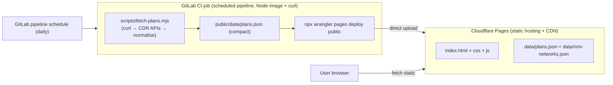

# Energy Compare Tool — Cloudflare Rebuild Design Document

**Purpose:** Replicate the existing "Energy Compare Tool" (currently on GitHub Pages + GitHub Actions) as a new project hosted on **Cloudflare Pages**, using only **free Cloudflare tools** for hosting and the scheduled data refresh. This document is written to be handed to an implementing agent; it specifies both the product and the infrastructure, and calls out the non-obvious lessons that will otherwise cost you a day.

---

## 1. What the tool is

A **static, browser-only** single-page web app for Australian households to find the cheapest electricity plan **for their own usage**. The user uploads their smart-meter interval CSV (an "NMI interval export"); everything is parsed and computed **client-side** — no usage data ever leaves the browser. The only network dependency is a static `data/plans.json` catalogue of real published plans, refreshed on a schedule.

### Feature list (must replicate)

1. **CSV upload** (drag/drop + file picker + "try sample"). Parses Australian NMI interval exports: 30-minute reads, columns `NMI, RegisterCode, RateTypeDescription, StartDate, EndDate, ProfileReadValue`. Auto-detects `Generalusage` vs `Controlledload` registers. Tolerant header matching so other half-hourly/hourly exports work.
2. **Usage insights**: totals (general/controlled/export kWh), average daily kWh, days of data; an average **daily load profile** (kWh per half-hour, line chart); a **day×hour heatmap**.
3. **Plan builder**: add any number of plans. Each plan: name, daily supply charge (c/day), controlled-load rate (c/kWh), solar feed-in (c/kWh), usage discount (%), and either a **flat** rate or **time-of-use** windows (peak/shoulder/off-peak with configurable days + start/end times, plus a default rate for uncovered times).
4. **Comparison / "the verdict"**: costs every plan against the actual usage, scaled to a full year; ranked table + annual-cost bar chart; cheapest highlighted.
5. **Extra comparison charts**: stacked cost breakdown (usage/controlled/supply/solar), cost-by-month line chart, and a **usage-vs-cost by time-of-day** overlay (bars = ¢ spent per half-hour on the selected plan, line = kWh used) with a plan selector.
6. **Load-shifting advisor**: for time-of-use plans, quantifies peak/shoulder usage, shows spend grouped by rate tier, and an interactive slider estimating annual savings from moving flexible load to off-peak, with plan-specific tips.
7. **Persistence & portability**: plans saved in `localStorage`; Export/Import plans as JSON.
8. **Load a published plan** (the catalogue): pre-fill a plan from real CDR data, with **network/distributor filter**, **postcode filter**, and brand/plan search.
9. **Automatic network detection**: read the NMI from the uploaded file, match it to the distribution network, and pre-filter the picker.

### Tech constraints

- Vanilla HTML/CSS/JS, **no build framework** for the frontend. Charts via **Chart.js UMD, vendored locally** (do not rely on a CDN at runtime — CSP/reliability). Theme-aware (light/dark).
- The whole frontend is static files. The only "backend" is the scheduled job that produces `data/plans.json`.

---

## 2. High-level architecture (Cloudflare)

> **This project is hosted on GitLab, not GitHub — there are no GitHub Actions.** The scheduler is **GitLab CI/CD scheduled pipelines**, and deploys go to Cloudflare Pages via **`wrangler pages deploy`** (direct upload). Cloudflare Pages does support connecting a GitLab repo for git-driven builds, but because the CDR crawl may be blocked from Cloudflare's own build IPs (see §8.1), the recommended pattern runs the crawl on a **GitLab runner** you control and uploads the result.



**Chosen approach (GitLab-native):** a **GitLab CI/CD scheduled pipeline** runs the crawl on a GitLab runner (full Node, no subrequest cap, curl available), then **`wrangler pages deploy`** uploads the built site (including the fresh `data/plans.json`) directly to Cloudflare Pages. GitLab's own scheduler does the "daily" part, so **no Cloudflare Worker and no deploy hook are needed**. Everything is free (GitLab free CI minutes + Cloudflare Pages free tier).

Two viable alternatives are documented in §6.3–§6.4: (A) connect the GitLab repo to Cloudflare Pages and let **Cloudflare's build** run the crawl, triggered daily by a **Worker Cron → Pages Deploy Hook**; (B) a chunked scheduled **Worker → R2/KV** if you ever want the data decoupled from deploys.

Why not "a Worker fetches the data on a schedule and writes it to KV/R2" as the default? Because the crawl makes **~2,000+ outbound requests** and Cloudflare Workers on the free plan cap **subrequests at 50 per invocation** (1,000 on paid). A single Worker invocation cannot do the full crawl. GitLab CI runners (and Cloudflare Pages builds) have **no subrequest cap**, so the crawl belongs there.

---

## 3. Repository layout

```
/
├─ index.html                 # markup + <template> blocks for plan cards / TOU rows / picker
├─ css/styles.css             # theme-aware styling (light + dark)
├─ js/
│  ├─ app.js                  # all client logic (IIFE, no deps)
│  └─ chart.umd.min.js        # vendored Chart.js v4 UMD build
├─ data/
│  ├─ plans.json              # GENERATED catalogue (committed or built)
│  ├─ nmi-networks.json       # AEMO NMI allocation patterns (static reference)
│  └─ retailers.json          # curated seed endpoints (discovery fallback)
├─ sample/sample-usage.csv    # synthetic demo data
├─ scripts/
│  ├─ fetch-plans.mjs         # data pipeline (Node, zero deps, shells out to curl)
│  └─ test-normalize.mjs      # offline unit tests for the normaliser
├─ functions/ or worker/      # (Cloudflare) cron worker — see §7
├─ wrangler.toml              # (Cloudflare) worker config
├─ _headers                   # (Cloudflare Pages) cache/security headers
├─ package.json               # "build" script = node scripts/fetch-plans.mjs
└─ README.md
```

---

## 4. Frontend specification

The frontend is unchanged from the current implementation and can be copied verbatim. Key details for a from-scratch rebuild:

### 4.1 CSV parsing (client)

- Split lines; a minimal quoted-CSV splitter (handle `"a,b"`).
- Header matching is **case/space-insensitive**. Column resolution by candidate names:
  - start time: `startdate | start | intervaldate | readingstartdate | datetime | timestamp`
  - end time: `enddate | end`
  - value (kWh): `profilereadvalue | usage | kwh | consumption | value | quantity` (fallback `registerreadvalue`)
  - rate desc: `ratetypedescription | ratetype | description`
  - register code: `registercode | register`
  - `nmi`
- **Date parsing:** the export is `DD/MM/YYYY hh:mm:ss AM/PM` (Australian). Parse manually (do **not** trust `new Date()` for `DD/MM`). Support a 12-hour clock with AM/PM and an ISO fallback.
- **Register classification:** controlled load if the rate description / register code contains `control`, `offpeak`, `off-peak`, or `#002`; else general.
- Interval length: default 30 min; if end time present, `round((end-start)/60000)+1` (exports end at `hh:29:59`).
- Capture the **first non-empty NMI** for network detection.

### 4.2 Data model (client plan object)

```js
{
  id, name,
  supply,        // c/day  (string or number; "" = unset)
  controlled,    // c/kWh applied to controlled-load reads
  feedin,        // c/kWh credit for negative (exported) reads
  discount,      // % off usage+controlled
  mode,          // "flat" | "tou"
  flat,          // c/kWh (flat mode)
  touDefault,    // c/kWh for intervals matching no window (tou mode)
  windows: [ { label, rate /*c/kWh*/, days:[0..6 Sun..Sat], from:"HH:MM", to:"HH:MM" } ]
}
```

### 4.3 Cost engine

For each interval (skip nothing; negatives = export):
- If `kwh < 0`: `feedinCents += -kwh * feedin` (credit).
- Else pick a rate:
  - controlled register and `controlled` set → `controlled`.
  - flat mode → `flat`.
  - tou mode → first matching window's rate, else `touDefault`. **Window match**: day in `window.days` AND time-of-day in `[from,to)`; if `from==to` treat as all-day; if `from>to` the window wraps midnight.
- Accumulate `usageCents` / `controlledCents`.
- Apply `discount` to usage+controlled. Add `supply * days`. Subtract solar credit.
- **Annualise**: `perYear = totalDollars * 365 / nDays`.

`nDays` = count of distinct calendar dates in the data.

### 4.4 Charts (Chart.js v4, vendored)

- Load profile: 48-point line (per half-hour), general + controlled datasets, averaged over `nDays`.
- Heatmap: 7×24 grid, average kWh per (weekday, hour), colour-scaled; hand-rolled with divs (no plugin).
- Comparison bar, stacked breakdown bar, monthly line, tier bar (horizontal), cost-profile dual-axis (bar ¢ + line kWh).
- **Resilience:** wrap every chart render in try/catch so a chart failure never breaks the rest of the app (`function safe(fn){try{fn()}catch(e){console.warn(e)}}` and a `hasChart()` guard).

### 4.5 Catalogue picker + filters

- Fetch `data/plans.json`; if `plans.length>0`, show the picker.
- Distributor `<select>` from `catalog.distributors`; **postcode** `<input>` (4-digit); brand/plan search; plan `<select>` (cap render at ~400 with a "refine" hint).
- **Filter logic** (`AND`): distributor (plan.distributors includes it) · postcode (plan's postcode set includes it — see §6.6) · search substring over brand+name+retailer.
- "Add this plan" clones the catalogue entry into an editable plan card.

### 4.6 NMI network detection (client)

- Load `data/nmi-networks.json`.
- `detectNetworkFromNmi(nmi)`: test both `nmi` and `nmi.slice(0,10)` (the 11th char is a checksum) against each network's regex `patterns`; return `{name, region}` on first match.
- Map the detected network name to a catalogue distributor string via an alias table (names differ, e.g. AEMO "SP AusNet" → catalogue "AusNet Services", "ACTEWAgl" → "Evoenergy"). Pre-select the distributor and show a dismissible note.

---

## 5. The data pipeline — `scripts/fetch-plans.mjs`

This is the heart of the rebuild and where all the sharp edges live. It is a **zero-dependency Node ESM script** that discovers retailer endpoints, crawls the Australian **Consumer Data Right (CDR) energy Product Reference Data (PRD)** APIs, normalises the tariffs into the client model, and writes `data/plans.json`.

### 5.1 The CDR PRD APIs

Public, unauthenticated JSON. Per retailer base URI:
- `GET {base}/cds-au/v1/energy/plans` — list (paginated; `page`, `page-size` up to 1000; `type=ALL`, `fuelType=ELECTRICITY`, `effective=CURRENT`). Response `data.plans[]`, `meta.totalPages/totalRecords`. **Each list item includes `geography` (distributors + includedPostcodes).**
- `GET {base}/cds-au/v1/energy/plans/{planId}` — full tariff detail.
- **Version header required:** send `x-v: <n>`. Negotiate high→low; a `406` means unsupported version, try another. Use `[3,2,1]` for detail (richest schema; the normaliser targets v3), and `[1,2,3]` for the list.

### 5.2 ⚠️ CRITICAL GOTCHA #1 — the WAF blocks `fetch`, use `curl`

The government CDR hosts sit behind a WAF that **rejects Node's native `fetch`/`undici` TLS fingerprint with `403`** but **accepts `curl`**. This is not a header problem — it's TLS/JA3 fingerprinting. The script therefore shells out to `curl` via `child_process.execFile` for every request:

```js
import { execFile } from "node:child_process";
function curlJson(url, versions = [3,2,1]) {
  return new Promise((resolve, reject) => {
    let lastErr = new Error("failed");
    const attempt = (i) => {
      if (i >= versions.length) return reject(lastErr);
      execFile("curl", ["-sS","--max-time","20","--retry","1",
        "-H",`x-v: ${versions[i]}`,"-H","Accept: application/json",
        "-w","\n%{http_code}", url], {maxBuffer:128*1024*1024}, (err, out) => {
        if (err) { lastErr = err; return attempt(i+1); }
        const nl = out.lastIndexOf("\n");
        const code = out.slice(nl+1).trim();
        if (code !== "200") { lastErr = new Error("HTTP "+code); return attempt(i+1); }
        try { resolve(JSON.parse(out.slice(0, nl))); } catch(e){ lastErr=e; attempt(i+1); }
      });
    };
    attempt(0);
  });
}
```

**GitLab/Cloudflare implication:** the crawl runs in a **GitLab CI** job (Node image + `curl`), which behaves like a normal Linux box. **Risk:** the CDR WAF may block whole datacenter IP ranges — whether GitLab's shared-runner IPs are blocked is unverified. This is the single biggest replication risk — see **§8.1** for the test-first check and mitigations (different runner image/region, or a self-hosted runner with a clean IP).

### 5.3 Endpoint discovery (three sources, merged + pre-probed)

There is no single official machine-readable list of **product** base URIs (the AER publishes them only as a PDF). Combine:

1. **Curated seed** `data/retailers.json` — the majors, as `{name, baseUri}`. Most retailers are hosted by the AER's **Energy Made Easy** at `https://cdr.energymadeeasy.gov.au/<slug>`.
2. **Community list** (primary discovery) — `https://raw.githubusercontent.com/jxeeno/energy-cdr-prd-endpoints/main/docs/energy-prd-endpoints.json`. This reconstructs the register and, crucially, exposes each brand's **`productReferenceDataBaseUri`** (the correct product base). Use this field.
3. **CDR Register** (fallback) — `https://api.cdr.gov.au/cdr-register/v1/energy/data-holders/brands/summary` (`x-v: 2`). Gives `publicBaseUri`.

#### ⚠️ GOTCHA #2 — `publicBaseUri` ≠ product base URI
The official register's `publicBaseUri` is the **auth/data-sharing** base; hitting `/cds-au/v1/energy/plans` there **404s** for self-hosting retailers. Only the community list's `productReferenceDataBaseUri` reliably points at products. For Energy Made Easy-hosted brands, `publicBaseUri` happens to equal the product base, which is why the register works as a fallback for those. Retailers you'd otherwise miss (Red Energy, Alinta, Sumo, Aurora, Diamond) are actually on Energy Made Easy under **hyphenated slugs** (`red-energy`, `sumo-power`, `alinta`, `aurora`, `diamond`) — the community list has them.

**Merge** all three, de-duplicate by base URI, then **pre-probe in parallel** (concurrency ~12, `curl --max-time 8`, `page-size=1`) and keep only endpoints returning `200` with `meta.totalRecords > 0`. This drops dead/self-host-only hosts fast (~38 of ~90 candidates serve residential electricity).

### 5.4 Normalisation rules (per plan detail → client plan)

Work on `detail.electricityContract` (skip if absent → gas-only). Take the tariff period covering today (`tariffPeriod[]` have `startDate`/`endDate` as `mm-dd` seasonal windows; else first).

#### ⚠️ GOTCHA #3 — CDR amounts are in DOLLARS, the app uses CENTS
Every `unitPrice` and `dailySupplyCharge` is an `AmountString` in **dollars per kWh / per day**. Multiply by 100. `"0.24500"` → `24.5` c/kWh; `"0.98000"` → `98` c/day.

- **Supply:** `dailySupplyCharge` (×100); if banded, first band's `unitPrice`.
- **Rate block** (`period.rateBlockUType`):
  - `singleRate` → flat mode, `flat = rates[0].unitPrice*100`.
  - `timeOfUseRates` → tou mode. Build entries `{type, rate, timeOfUse[]}`.
    #### ⚠️ GOTCHA #4 — TOU default is the OFF_PEAK **type**, not the numeric minimum
    Choose `touDefault` from the entry whose `type === "OFF_PEAK"` (fall back to the lowest rate only if no OFF_PEAK exists). Then emit **every other entry** as explicit windows — **including 0¢ "free" / solar-sponge windows** (e.g. AGL "Three for Free"). If you naively use `min(rate)` as the default, a free window becomes the all-day rate and the plan looks almost free. Days map `SUN..SAT` → `0..6` (drop `PUBLIC_HOLIDAYS`). Times are ISO (`"15:00:00"` / `"1500"`), normalise to `HH:MM`; map `24:00`→`00:00`.
  - `demandCharges` → **skip the plan** (demand tariffs aren't modelled).
- **Controlled load:** first `controlledLoad[]`; single rate ×100, or min of TOU tiers.
- **Solar feed-in:** prefer `payerType==="RETAILER"`; `singleTariff.rates[0].unitPrice*100`, else first time-varying rate.
- **Discount:** leave blank (PRD discounts are conditional/complex; out of scope).

#### ⚠️ GOTCHA #5 — sanity bounds (reject junk, don't mislead)
After computing, **skip the plan** (return null) if any residential value is implausible — real bad data exists (e.g. a $13.72/day supply charge). Bounds:
- supply: `0–500` c/day
- any per-kWh rate (flat / touDefault / controlled / window): `0–250` c/kWh
- feed-in: `0–150` c/kWh

### 5.5 ⚠️ GOTCHA #6 — network-aware sampling (not first-N)
Big retailers have 500–1,500 plans (duplicated across networks/segments). You must cap, but **cap per (retailer × network)**, not "first N per retailer" — otherwise a retailer's sample skews to whichever network lists first (symptom: "AGL has no Sydney plans"). Group each retailer's listed plans by `geography.distributors[0]`, take up to `MAX_PER_NETWORK` (≈8) each, bounded by `MAX_PER_RETAILER`. Result: every capital surfaces the majors; TAS correctly shows only TAS-active retailers.

Env knobs: `MAX_PER_NETWORK≈8`, `MAX_PER_RETAILER≈120`, `MAX_PLANS≈2600`. Current output ≈ 2,200 plans across all 15 networks, ~1 MB compact JSON.

### 5.6 De-duplication
- **Plans:** dedupe by `planId` (alias endpoints repeat plans).
- **Postcodes:** each plan lists ~200+ `includedPostcodes`, but there are only **~29 distinct coverage sets** across the whole catalogue. Store each unique set once in a top-level `postcodeSets: string[][]`, and give each plan a `pc` index into it (or `null`). This keeps the file ~1 MB instead of ~several MB.

### 5.7 Output — `data/plans.json` (compact, single line)

```jsonc
{
  "generatedAt": "ISO-8601",
  "source": "Australian CDR energy Product Reference Data",
  "planCount": 2208,
  "distributors": ["Ausgrid","Energex", ...],   // for the filter dropdown
  "postcodeSets": [ ["2000","2001",...], ... ],  // de-duplicated coverage areas
  "retailers": [ {"retailer","listed","normalised"|"error"} ],  // run report
  "plans": [
    {
      "source":"cdr","planId","brand","name","retailer",
      "fuelType","customerType",
      "distributors":["Ausgrid"], "pc": 3,        // index into postcodeSets
      "applicationUri",
      "supply","controlled","feedin","discount",
      "mode","flat","touDefault",
      "windows":[ {"label","rate","days":[1,2,3,4,5],"from":"15:00","to":"21:00"} ]
    }
  ]
}
```
Write with `JSON.stringify(output)` (no indentation) — it's fetched by every browser; keep it small (Cloudflare gzips/brotli it to ~150 KB over the wire).

### 5.8 `data/nmi-networks.json` (static reference)

AEMO NMI allocation patterns for the 13 distribution networks. Regenerate from the `aemo` Ruby gem's allocation table (`https://raw.githubusercontent.com/jufemaiz/aemo/main/lib/aemo/nmi/allocation.rb`) — parse each electricity allocation's `includes` regexes, `friendly_title`, `region`. Shape:
```json
{ "source":"AEMO NMI Allocation List",
  "networks":[ {"name":"Ausgrid","region":"NSW","patterns":["NCCC[A-HJ-NP-VX-Z\\d][A-HJ-NP-Z\\d]{5}","410[234]\\d{6}"]}, ... ] }
```
Clean display names to current ones (SP AusNet→AusNet Services, ACTEWAgl→Evoenergy, PowerCor→Powercor). This file changes rarely; commit it (no need to regenerate in the daily build).

### 5.9 Tests — `scripts/test-normalize.mjs`
Offline unit tests (no network) asserting: dollars→cents; flat/TOU/controlled/solar mapping; OFF_PEAK-as-default with a preserved 0¢ window; HHMM time parsing; demand-only and gas-only skipped; sanity bounds reject absurd supply/rate. Run in the build before fetching.

---

## 6. Cloudflare implementation

### 6.1 Cloudflare Pages (hosting)

Two ways to get files onto Pages; this project uses **direct upload from GitLab CI** (§6.3) as the primary, with git-connected build as an alternative (§6.4).

- **Direct upload (recommended here):** `npx wrangler pages deploy <dir> --project-name=<name>`. Create the Pages project once (dashboard → Workers & Pages → Create → Pages → *Direct upload*, or `wrangler pages project create`). No git connection required — GitLab CI pushes each build. This decouples the crawl from Cloudflare's build IPs (see §8.1).
- **Git-connected build (alternative):** connect the GitLab repo in the Pages dashboard and set a build command; Cloudflare's build container runs the crawl (§6.4).
- **Static layout:** put the site under `public/` (`public/index.html`, `public/css`, `public/js`, `public/data/...`). The build script writes `public/data/plans.json`. Deploy dir = `public`.
- Free tier: unlimited requests/bandwidth, unlimited sites; direct-upload deploys are effectively unlimited. `data/plans.json` is served as a static asset from Cloudflare's CDN — **no Worker needed to serve data**.

### 6.2 `_headers` (caching + security)

```
/data/plans.json
  Cache-Control: public, max-age=3600, stale-while-revalidate=86400
/js/*
  Cache-Control: public, max-age=604800, immutable
/css/*
  Cache-Control: public, max-age=604800, immutable
/*
  X-Content-Type-Options: nosniff
  Referrer-Policy: no-referrer
```
(Optionally add a strict `Content-Security-Policy`; since Chart.js is vendored and there are no third-party scripts, `script-src 'self'` works — allow `'unsafe-inline'` only if you keep inline scripts, otherwise move them to files.)

### 6.3 Scheduled refresh — GitLab CI pipeline + `wrangler pages deploy` (PRIMARY)

The crawl and the deploy both run in one GitLab CI job; GitLab's **pipeline schedule** makes it daily. No Cloudflare Worker, no deploy hook.

**`.gitlab-ci.yml`:**
```yaml
stages: [test, deploy]

variables:
  NODE_VERSION: "20"

unit-tests:
  stage: test
  image: node:20
  script:
    - node scripts/test-normalize.mjs

build-and-deploy:
  stage: deploy
  image: node:20            # Debian-based → curl is available (install if slim)
  script:
    - apt-get update && apt-get install -y curl   # if not already present
    - node scripts/fetch-plans.mjs                 # writes public/data/plans.json
    - npx --yes wrangler@3 pages deploy public
        --project-name "$CF_PAGES_PROJECT"
        --branch main
        --commit-dirty=true
  variables:
    CLOUDFLARE_API_TOKEN: "$CLOUDFLARE_API_TOKEN"  # from CI/CD variables (masked)
    CLOUDFLARE_ACCOUNT_ID: "$CLOUDFLARE_ACCOUNT_ID"
    OUT_FILE: "public/data/plans.json"
    MAX_PLANS: "2600"
    MAX_PER_RETAILER: "120"
    MAX_PER_NETWORK: "8"
```

Setup:
1. **Cloudflare API token** — dashboard → My Profile → API Tokens → Create, permission **Account · Cloudflare Pages · Edit**. Copy the token and your **Account ID**.
2. **GitLab CI/CD variables** (Settings → CI/CD → Variables, masked/protected): `CLOUDFLARE_API_TOKEN`, `CLOUDFLARE_ACCOUNT_ID`, `CF_PAGES_PROJECT` (your Pages project name). `wrangler` reads the first two from the environment automatically.
3. **Schedule** — Settings → CI/CD → **Pipeline schedules** → New schedule, cron `0 17 * * *` (17:00 UTC ≈ 03:00 AEST), target branch `main`. Each run crawls fresh data and redeploys. (Regular pushes to `main` also deploy, giving you code + data deploys from the same pipeline.)

Note: make `fetch-plans.mjs` honour `OUT_FILE` (it already does) so it writes into `public/data/`. Keep `data/nmi-networks.json` and the placeholder `data/plans.json` under `public/data/` in the repo so pushes deploy a working site even before the first scheduled crawl.

### 6.4 (Alternative A) Git-connected Cloudflare Pages build + Worker Cron → Deploy Hook

If you'd rather Cloudflare build from the connected GitLab repo:
1. Connect the GitLab repo in the Pages dashboard; build command `npm run build` (`"build": "node scripts/test-normalize.mjs && node scripts/fetch-plans.mjs"`), output dir `public`, env `NODE_VERSION=20` + `MAX_*`.
2. Create a **Deploy Hook** (Pages → Settings → Builds & deployments). Schedule daily rebuilds with a tiny **Worker Cron Trigger** that POSTs the hook:
   ```toml
   # wrangler.toml
   name = "energy-compare-refresh"
   main = "worker/refresh.js"
   compatibility_date = "2024-11-01"
   [triggers]
   crons = ["0 17 * * *"]
   ```
   ```js
   // worker/refresh.js
   export default { async scheduled(_e, env) { await fetch(env.DEPLOY_HOOK_URL, { method: "POST" }); } };
   ```
   `wrangler secret put DEPLOY_HOOK_URL` then `wrangler deploy`.

Caveat: this runs the crawl on **Cloudflare's build IPs**, which may be WAF-blocked (§8.1). The §6.3 GitLab-runner path avoids that risk, which is why it's primary.

### 6.5 (Alternative B) Decoupled data via Worker + R2/KV — only if you must

To refresh data **without** redeploying, a Worker could crawl and write `plans.json` to **R2** (10 GB free, free egress via Workers) or **KV**. **But** free Workers cap **50 subrequests/invocation**, so one invocation can't crawl ~2,000 endpoints — you must **chunk** across invocations/**Queues** (a few retailers each, accumulate in KV, assemble at the end). It also depends on the CDR WAF accepting the Workers `fetch` (Workers can't shell out to `curl`), which is unverified and likely to fail. Not recommended unless you have a concrete need.

### 6.6 Optional free Cloudflare extras

- **Web Analytics** (free, privacy-first, cookieless): add the beacon snippet to `index.html` for pageview stats without compromising the "no tracking" ethos.
- **D1** (free SQLite): only if you later want server-side postcode→plan queries; not needed — the client filters `postcodeSets` fine.
- **Cache Rules / Tiered Cache**: defaults are fine for a static site.

---

## 7. Step-by-step setup (GitLab + Cloudflare Pages, primary path)

1. Create the GitLab repo with the layout in §3, static files under `public/`. Copy the frontend (`public/index.html`, `public/css/`, `public/js/` incl. vendored `chart.umd.min.js`, `public/sample/`) and `scripts/` verbatim from the reference implementation.
2. `package.json`:
   ```json
   { "private": true, "type": "module",
     "scripts": { "build": "node scripts/test-normalize.mjs && node scripts/fetch-plans.mjs",
                  "test": "node scripts/test-normalize.mjs" } }
   ```
   Ensure `scripts/fetch-plans.mjs` writes to `OUT_FILE` (default it to `public/data/plans.json`).
3. Commit `public/data/nmi-networks.json` and `data/retailers.json`, plus a placeholder `public/data/plans.json` (`{"planCount":0,"plans":[]}`) so the site works before the first crawl.
4. Create the Cloudflare Pages project (once): `npx wrangler pages project create <name>` (or dashboard → Pages → *Direct upload*). Create a Cloudflare **API token** (Account · Cloudflare Pages · Edit) and note the **Account ID**.
5. Add GitLab **CI/CD variables** (masked): `CLOUDFLARE_API_TOKEN`, `CLOUDFLARE_ACCOUNT_ID`, `CF_PAGES_PROJECT`. Add `.gitlab-ci.yml` from §6.3.
6. Push. The pipeline runs tests → crawl → `wrangler pages deploy public`. Confirm `https://<name>.pages.dev/` serves the app and `/data/plans.json` has real plans. **If the crawl returns mostly failures/403s, GitLab-runner IPs are WAF-blocked (§8.1)** — try a different runner/image, or self-host a runner.
7. Add **Pipeline schedule** (daily) per §6.3. Add `public/_headers` (§6.2). (Optional) custom domain, Web Analytics.

**Acceptance criteria:** upload the sample CSV → usage charts render; add two plans → verdict + charts; "Load a published plan" shows ~2,000 plans; a real NMI (`6305…` = AusNet/VIC) auto-selects the network; postcode `2000` filters to ~200 Sydney plans and includes AGL/Origin/EnergyAustralia/Red; `node scripts/test-normalize.mjs` passes.

---

## 8. Known risks & mitigations

**§8.1 — The #1 risk:** the CDR WAF **always blocks Node `fetch`** (use `curl`) and **may block whole datacenter IP ranges**. The crawl is known to work from GitHub-hosted runners; whether **GitLab's shared runners** (or **Cloudflare's build IPs**) are blocked is **unverified — test first** with a single retailer (`curl -H "x-v: 1" https://cdr.energymadeeasy.gov.au/agl/cds-au/v1/energy/plans?page-size=1`). If blocked: try a different runner image/region, or register a **self-hosted GitLab runner** (e.g. a small VM / your own IP) for the `build-and-deploy` job — that runner's IP is very unlikely to be blocked. As a last resort, run the crawl anywhere with a clean IP and `wrangler pages deploy` from there.

| # | Risk | Mitigation |
|---|------|-----------|
| 1 | **CDR WAF blocks the crawl** (Node `fetch` always; some datacenter IPs). | Use `curl` (done). Run the crawl on a GitLab runner; if its IP is blocked, use a self-hosted runner (§8.1). Test early with one retailer. |
| 2 | **Worker 50-subrequest cap** makes a single-invocation crawl impossible on free. | Crawl in **GitLab CI** (no cap), not a Worker. Any Worker used is only for pinging a deploy hook (§6.4). |
| 3 | Retailer coverage skew. | Network-aware sampling (§5.5). |
| 4 | Bad tariff data skews comparisons. | Sanity bounds (§5.4 gotcha #5); skip demand-only/gas. |
| 5 | Community endpoint list unavailable. | Register + curated seed as fallbacks; dedupe/pre-probe tolerates missing sources. |
| 6 | Dollars-vs-cents / OFF_PEAK-default bugs. | Follow gotchas #3 and #4 exactly; keep the unit tests. |
| 7 | Large `plans.json`. | Compact JSON + postcode-set dedup; Cloudflare brotli. Tune `MAX_*` if needed. |

---

## 9. Scope notes

- Covers National Energy Customer Framework jurisdictions (NSW, QLD, SA, TAS, ACT). Victoria has a separate scheme; VIC networks still appear via retailers that publish through Energy Made Easy.
- List/market residential rates only — not personalised or conditionally-discounted offers.
- Estimates for comparison; always confirm on the retailer's site (keep the on-page disclaimer).
- Privacy: usage data stays in the browser; the only fetch is the static catalogue. Preserve this — do not add server-side upload of usage data.

---

## 10. Reference: key constants

- **Day map:** `{SUN:0,MON:1,TUE:2,WED:3,THU:4,FRI:5,SAT:6}` (ignore `PUBLIC_HOLIDAYS`).
- **pricingModel values:** `SINGLE_RATE, SINGLE_RATE_CONT_LOAD, TIME_OF_USE, TIME_OF_USE_CONT_LOAD, FLEXIBLE, FLEXIBLE_CONT_LOAD, QUOTA`.
- **TOU types:** `PEAK, OFF_PEAK, SHOULDER, SHOULDER1, SHOULDER2`.
- **Community endpoints JSON:** `https://raw.githubusercontent.com/jxeeno/energy-cdr-prd-endpoints/main/docs/energy-prd-endpoints.json` (field `productReferenceDataBaseUri`).
- **CDR Register summary:** `https://api.cdr.gov.au/cdr-register/v1/energy/data-holders/brands/summary` (`x-v: 2`).
- **Energy Made Easy host:** `https://cdr.energymadeeasy.gov.au/<slug>` — slugs include `agl, origin, energyaustralia, red-energy, alinta, sumo-power, aurora, diamond, powershop, actewagl, engie, momentum, dodo, tango, globird, nectr, amber, kogan, lumo, ergon, ovo-energy` (+ community-discovered).
- **AEMO NMI allocation source:** `https://raw.githubusercontent.com/jufemaiz/aemo/main/lib/aemo/nmi/allocation.rb`.
